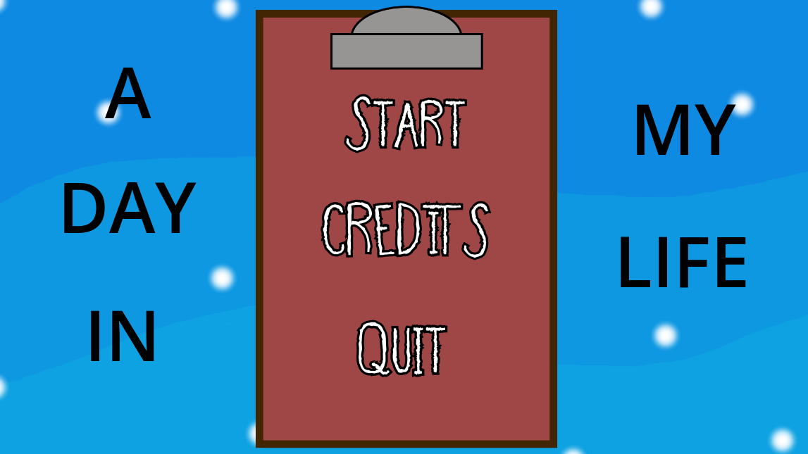
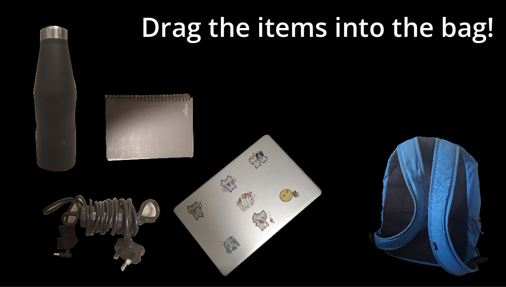
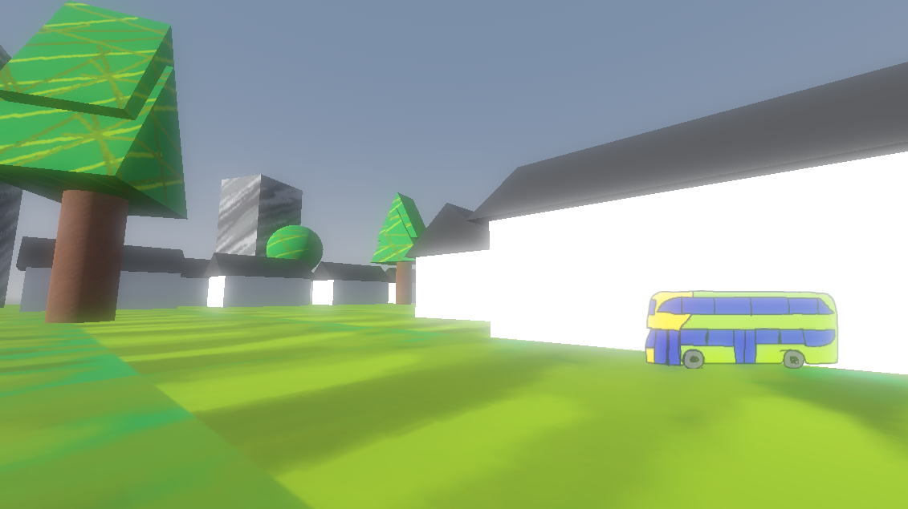

# A Day in my Life

Name: Dziugas

Student Number: A00037886

Class Group: TU984

# Gameplay Demo Video

# Screenshots

Titlescreen Image

2D Gameplay

3D Gameplay

# Description of Project
A game dedicated to the 2026 final assessment for Creative Coding.
Spend the morning gathering your belongings and rushing for the bus.
With a task list, you cannot leave until you have remembered to complete your daily tasks.

# Instructions for use
Run the game through the web on [Itch](https://kryptix0.itch.io/my-daily-life).
Interact with the window to change the sky with V next to the window.
Interact with the NPC, as well as complete tasks by going near their collision and pressing E when given the prompt.
WASD to move, Space to jump, M1 during minigame to drag objects into bag.

# How it works
A Day in my Life uses a lot of checks for true and false, whether this is to check on collisions between the player and collisions between task items, as well as the window, up to NPC interaction. 
Tasks specifically check for the colour GREEN in the script to ensure all tasks are GREEN before allowing a prompt to exit the room.
Built as an exploration game to do with daily life, it is a linear game with a set goal.

Checks
- True/False on colours to allow collision on door
- All items gathered
- Input on keys to toggle sky colours
- Input on keys to toggle interaction within range

Change of Scenes
- Menu
- Main Scene
- Credits
- Outside
- End Screen

Minigame
- Tasks:
- Packing bag
- Collecting key
- Putting clothes on

# List of classes/assets in the project

| Class/asset | Source | Use |
|-----------|-----------|-----------|
| BusNPC.gd | Self written | Interaction of First Bus NPC |
| BusUni.gd | Self written | Gateway to End Screen |
| character_body_3d.gd | Self written | Movement/Head Bobbing |
| credits_probably.gd | Self written | Credits with Back Arrow |
| Door.gd | Self written | Checks for green labels |
| endscreen.gd | Self written | Animate between 2 images |
| Key.gd | Self written | Handles Key interaction |
| main_menu.gd | Self written | Gateway to Start/Credits/Quit |
| panel.gd | Self written | If tasks are complete, makes task green |
| wardrobe.gd | Self written | Handles Wardrobe interaction |
| window_zone.gd | Self written | Handles Colour Switching Through RGB |
| area3d.gd | Self written | Interaction With Bag / Gateway to Minigame |
| bag_minigame.gd | Self written | Minigame which counts items in collision of bag |

# What I'm most proud of this assignment
- Dziugas Januska
Learning code through youtube videos and being able to mash it all together to create something, as well as adapt on my blender knowledge. 
Slightly more comfortable with using github through pushing godot aspects.

# What I learned
Minigames which use dragging positions, true/false checks, coloured text checks, NPCs

## Code Examples
